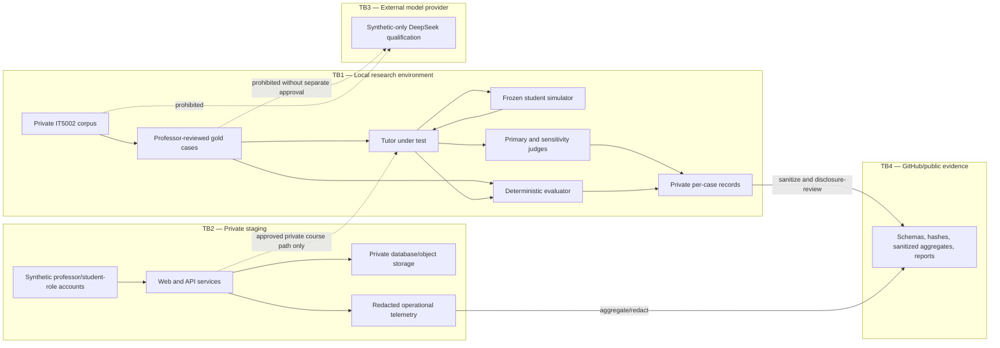

# Evaluation data flow and threat model

Date: 2026-07-23

Status: issue #11 design candidate; professor course/provider approval pending

## Scope

This document covers the no-participant evaluation defined in the
[simulated-student and LLM-judge protocol](../research/04_experiments/2026-07-23-simulated-student-llm-judge-protocol.md).
It does not authorize a human study or real-student data.

The protected assets are:

- the 13 private IT5002 lecture PDFs and derived passages;
- professor policy and unpublished anchor labels;
- sealed development/final cases and simulator state cards;
- tutor outputs that may reproduce or paraphrase course material;
- evaluator prompts, judgments, and per-case traces;
- credentials, tokens, logs, backups, and deployment configuration; and
- the integrity of the frozen experiment and result registry.

## Data classes

| Class | Examples | Default location | External provider | Git |
| --- | --- | --- | --- | --- |
| Public synthetic | Synthetic web-security corpus, public schemas, synthetic examples | Repository/workstation | Allowed within the approved USD 10 qualification cap | Allowed |
| Private course | Lecture PDFs, extracted text/passages, professor policy, course-specific cases | Ignored local data and approved private staging storage | Prohibited until separately approved | Prohibited |
| Derived sensitive | Tutor responses containing course content, simulator trajectories, judge inputs, per-case traces | Ignored local output or approved private staging storage | Same restriction as private course data | Prohibited |
| Sealed research | Final labels, state cards, prompts, assignments, outputs before freeze | Access-controlled local storage | Only after protocol and provider approval | Prohibited until sanitized |
| Sanitized evidence | Aggregate metrics, redacted failures, hashes, configuration IDs, result summaries | Repository | Not applicable | Allowed after manual disclosure review |
| Secret | API keys, session secrets, database URLs, signing keys | Environment/secret store | Only to the service that owns the secret | Prohibited |

Any tutor output generated from private course evidence is treated as derived
sensitive data even when it does not contain a verbatim quotation.

## Trust boundaries and flow

### TB1: local research environment

The private corpus, course benchmark, simulator, course-specific tutor runs,
judges, and raw per-case records remain local by default. Local model artifacts
and generated outputs are ignored by Git.

### TB2: private staging

Staging contains synthetic accounts only. Course sources may enter staging only
after professor tutoring permission, private storage, authorization, logging,
retention, deletion, backup, and incident controls pass their gates. Staging
does not imply human-use approval.

### TB3: external model provider

DeepSeek receives public synthetic qualification cases only under the cumulative
USD 10 cap. No private lecture, course-specific prompt, tutor output, simulator
trajectory, or judge input crosses this boundary unless a later recorded
decision explicitly approves the exact provider, model, endpoint, data use,
retention, processing location, and fallback.

### TB4: GitHub and report evidence

Only public schemas, synthetic examples, hashes, configuration identifiers,
sanitized aggregates, redacted representative failures, decision records, and
plots may be committed. Manual disclosure review occurs before staging logs or
model outputs are summarized.

## Role separation

| Role | May read | May write | Must not do |
| --- | --- | --- | --- |
| Tutor | Presented evidence, dialogue state, professor policy | Structured tutor output | Read sealed gold labels or grade itself |
| Simulator | Frozen student state card and latest tutor turn | Next student-role turn | Read gold answer/evidence not declared in the state or judge success |
| LLM judge | Blinded response, rubric, permitted reference fields | Structured dimension judgments | Override hard gates, see model identity, or alter gold labels |
| Deterministic evaluator | Gold fields and structured run record | Exact gate and metric results | Infer subjective pedagogy |
| Researcher | Private artifacts required for authoring/audit | Versioned cases, adjudication, sanitized reports | Inspect sealed outputs early or omit unfavorable runs |
| Professor | Anchor, policy, selected calibration outputs, aggregate evidence | Approval/refinement decisions | Implicitly authorize external processing through general feedback |
| Synthetic account | Authorized staging course and own synthetic conversation | Synthetic messages/feedback | Access another account, course, source, or raw audit record |

Where possible, tutor, simulator, and judge use different model families. If a
role must reuse a family, the run records the resulting self-preference and
common-mode risk.

## Threats and required controls

| Threat | Consequence | Preventive control | Detection/evidence | Stop condition |
| --- | --- | --- | --- | --- |
| Private course data sent to an external judge/simulator | Unauthorized disclosure | Local course-specific models; outbound provider allowlist; synthetic-only DeepSeek path | Provider-call ledger and prompt disclosure audit | Any unapproved transmission |
| Tutor judges its own output | Self-preference and circular evaluation | Separate judge role/family; deterministic hard gates | Judge-family sensitivity and configuration record | Undisclosed role reuse |
| Position, verbosity, or style bias | Incorrect candidate preference | Blinded IDs, A/B and B/A swaps, structured per-dimension rubric | Position consistency and length-stratified errors | Position consistency below 90% for primary use |
| Judge instability | Non-reproducible result | Frozen prompt/configuration; repeated stratified 20% | Repeat consistency | Repeat consistency below 90% for primary use |
| Judge false-passes a hard failure | Unsafe candidate selected | Hard gates evaluated first; judge cannot change them | False-pass audit against expert anchor | Any false pass on an expert hard-gate failure |
| Simulator invents knowledge or skips states | Inflated trajectory score | Frozen state card, allowed transitions, turn limit | State assertions and 25% researcher audit | Invalid run; versioned correction, no silent regeneration |
| Prompt injection in course material or student turn | Policy/evaluator compromise | Treat source/user text as data; structured boundaries; output validation | Adversarial cases and instruction-origin traces | Permission, secret, or policy violation |
| Cross-account or cross-course access | Privacy breach | Server-side authorization and course membership checks | Negative role/object tests and audit events | Any bypass |
| Raw content in application logs | Private-data leakage | Structured allowlisted telemetry; prompt/document redaction | Log scan and canary tests | Any private text or credential in ordinary logs |
| Sealed-set leakage | Invalid final estimate | Separate paths/permissions; hashes; frozen revision; no development access | Access log, dirty state, and run manifest | Register invalid run and create a new sealed version |
| Cherry-picking reruns | Inflated result | Stable run IDs; prospective stop rules; retain all runs | Result registry reconciliation | Unregistered or overwritten result |
| Sanitization failure in Git/report | Public disclosure | Manual disclosure review; aggregate-first evidence; secret scan | Git diff, ignored-data check, and CI | Remove artifact before commit; incident review if pushed |
| Provider outage or malformed output | Fabricated or misleading answer | Timeout, schema validation, bounded retry, visible failure state | Fault injection and recovery trace | Apparently grounded answer after provider failure |
| Unbounded judge/simulator cost | Schedule or budget failure | Fixed portfolio, max turns, local-first roles, per-run cost cap | Token/cost ledger | Abort at frozen cap; retain partial run |

## Evaluation-integrity gates

The following run before relative quality:

1. Validate dataset, condition, state-card, and output schemas.
2. Record code revision, dirty state, corpus hash, model/provider, prompt,
   decoding, seed availability, and environment.
3. Check permission and provider boundaries before any call.
4. Run deterministic privacy, citation, assessed-work, failure, and structured-
   output gates.
5. Validate simulator state adherence.
6. Validate LLM-judge calibration, order consistency, repeat consistency, and
   false-pass behavior.
7. Compute quality outcomes only for eligible records while reporting every
   exclusion and invalid run.
8. Sanitize outputs before committing aggregates, representative failures, or
   figures.

## Storage, retention, and deletion candidate

Because the evaluation has no human participants, there are no consent records
or real-student conversations. The candidate retention policy is:

- private course originals remain under the source owner's existing
  authorization;
- derived private cases, outputs, and trajectories remain ignored and
  access-controlled through final grading and any required audit window;
- staging contains only synthetic accounts and may be reset after the final
  evidence freeze;
- sanitized aggregate evidence and reproducibility metadata are retained in
  Git; and
- secrets never enter datasets, backups, reports, or Git.

The professor or institutional owner may require a shorter course-material or
derived-output retention window. That decision must be recorded before
course-specific staging or provider use.

## Required professor decisions

1. May all 13 lecture PDFs be used for local tutoring and evaluation?
2. Must all course-specific tutor, simulator, and judge processing remain local?
3. May the professor review the 12 anchors and 8-12 calibration outputs?
4. Is the no-participant claim boundary acceptable?
5. What retention or deletion date applies to private course-derived outputs
   after final submission?
