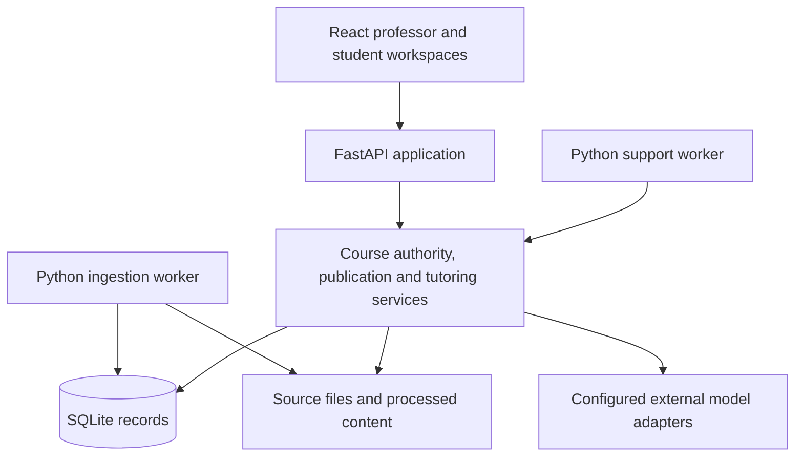

# Final report versus the latest presentation

Comparison date: 9 September 2026. This document distinguishes the submitted report, the latest delivered slides, and subsequent implementation/deployment records. It does not revise the report, qualify a candidate, or report a new experiment.

## Sources and comparison boundary

**R — submitted report:** [report-with-appendices.pdf](../reports/submitted/2026-09-06/report-with-appendices.pdf), 34 pages, preserved in the [submission snapshot](../reports/submitted/2026-09-06/README.md). Its title is *An Instructor-Configurable Digital Twin for Autonomous Course Tutoring*. Page references below are PDF pages, which match its printed page numbers.

**S — latest delivered presentation:** `/Users/hikaru/Desktop/Course Digital Twin — Final Presentation/Course Digital Twin.pptx` (local inspection source), **70 slides**, saved **9 September 2026, 16:49 Singapore time**. Its title is *Architecting a Digital Twin for Scalable, Style-Aligned Instructor Presence*. The matching speaker script at `/Users/hikaru/Desktop/Course Digital Twin — Final Presentation/speaker-script.md` and delivery README identify this package. Slide references below refer to this 70-slide version, not the earlier 60- or 61-slide reviews. It is the newest PPTX found in the repository presentation directory and the Desktop Course Digital Twin delivery folders inspected for this comparison.

**C — current repository evidence:** the specifically linked code, profiles and result records below. Inspected HEAD was `9b16c15b8c1463b4f2ed1bbdbe2b25e65a436f5d`, with substantial pre-existing tracked and untracked changes. HEAD alone does not reproduce that working tree. “Implemented,” “demonstrated,” “experimentally compared,” and “selected for the default release” are different statuses.

Source fingerprints, calculated directly from the compared files:

| File | SHA-256 |
| --- | --- |
| R | `240ec6154541d64394a102b4a4ebd2315eddd0f1584f021cfa559e5a84bfe909` |
| S | `7453cff7de77b597a61abc39766e3cb948ab2f0b3083d9b835a2a91dcb6f6d76` |

The report fingerprint matches the preserved submission manifest. Every report page and every slide's extracted text and notes were read. Architecture and selected diagram/chart images were also inspected, including content absent from PPTX text extraction. This is a content and architecture comparison, not a new frame-by-frame video audit or live deployment test. Recorded demo behavior is attributed to the deck and its supporting records. No private lecture passages or full student-like dialogue are reproduced here.

## Main differences

The **core architecture is substantially continuous**: React, FastAPI, Python domain services/workers, SQLite, source-file storage, scoped published releases, external model adapters and application-controlled delivery. The presentation reorganizes that architecture around the user journey and explicitly separates three answer paths. It does not establish a wholesale replacement of the report's selected system. R §§3.1–3.2, 5.1; S9, S14, S68.

The largest additions to the presentation are the actual IT5004 teaching examples and recordings, the post-report audited-generation comparison, source-gated model assessment, and a larger learner/timing comparison that adds a decayed-count estimator. The slides also explain existing instructor signals and recovery behavior more concretely. Some added slides describe **older experiments omitted or compressed in the report**; their inclusion does not make the underlying work new.

Both artifacts retain the same broad acceptance limits: factual quality remains below its stated targets; exact instructor fidelity, real-student learning benefit and production scale remain unestablished. The newer candidate has not earned promotion. The [final experimental decision](../research/05_evaluation/profiles/post-report-final-decision-v1.json) explicitly keeps the default release unchanged.

## Overall architecture: report, slides and current code

### Shared system structure

R Figure 2 on p. 5 emphasizes shared application responsibilities and the interfaces underneath them. S9 instead draws the running components and their connections. These are complementary views of essentially the same structure:

This is a simplified responsibility map derived from R Figure 2 and S9, not a new physical deployment specification. Model calls depend on the selected path. The diagram does not assert that every student turn invokes a model.

| Boundary | Submitted report | Latest presentation | What changed / what did not |
| --- | --- | --- | --- |
| UI and API | React professor/student workspaces, FastAPI handlers and Python domain services. R pp. 2–6. | Same components; stronger emphasis on actual screen workflows. S4, S6–9, S60. | More concrete demonstration and a different diagram view; no frontend/backend framework replacement shown. |
| Persistence | SQLite domain records and LangGraph checkpoints; source files on disk. R pp. 4–5, 27. | Shared SQLite records, file storage, worker jobs and checkpoint continuity. S9, S42, S45. | Same main storage boundaries. S45 is a logical relationship diagram, not evidence of a schema migration. |
| Source authority | Ingestion does not authorize use. Preflight and publication bind approved source versions and policy. R pp. 2–4, 28. | Same gates with IT5004 source locations and stable teaching-profile binding. S10, S27. | New concrete example, existing authority contract. |
| Retrieval | BM25, explicit evidence selection and dominance-aware ambiguity handling. R pp. 6, 14–16, 20. | Same retained factual baseline; explicit three-stage retrieve/select/assemble explanation. S17–21. | No accepted switch to semantic/hybrid or visual retrieval. |
| Reactive wording | Selected factual generator assembles approved claims deterministically; richer generation remains experimental. R pp. 6–7, 19–20. | Three named paths, with audited generated teaching used for the demo. S7, S12–14, S29–36. | New experimental composition and clearer separation; the demo does not replace the retained factual generator. |
| Model/application authority | Model generation outside transactions; application rechecks permission at commit and owns state. R pp. 4, 7, 10–12. | Models draft/review/propose; code validates, saves, withholds and authorizes delivery. S7, S32, S41–43. | Same trust boundary, explained in greater detail. |
| Proactive wording | Selected bounded strategy plus approved-source/template assembly; richer instructional adapters experimental. R p. 11. | Event-driven bounded wording and a general reminder in the replay. S39, S42–44. | Do not infer that the new reactive final audit now governs every background message. Current integration records explicitly distinguish those paths. |
| Learner input to planning | Default planner uses delivery count and observation-ID proxies; committed assessment counters serve completion separately. R pp. 7–9. | Assessment, prediction and timing are explicitly separated; research policies are not the demo planner. S44, S46–52. | Optional assessed-evidence adapters now exist in code; the slides do not show all alternatives running as one enabled chain. |
| Goal completion | Exact objective/concept scope; two correct, no incorrect, confidence ≥0.5 for every target concept. R p. 8, pp. 21–22. | Same corrected cumulative rule and same 72-history regression. S53–54. | This correction was already in the submitted report. A separate recovery-aware option exists in current code, described below. |
| Outreach triggers | Scheduled support and durable activity events; leases, bounded jobs, consent/timing checks, stable delivery keys. R pp. 3, 10–13. | Explicit three-way split: professor schedule, activity/time event, and new-evidence recovery. S38–43, S57. | Better separation; new-evidence recovery is observation-only and has historical evidence predating submission. |
| Instructor feedback | Five-learner suppression; aggregate source-level difficulty signals and instructor review. R p. 2. | Phrase rules, stored help level, aggregation, fixed suggestion and saved professor decision. S60–64. | Much more implementation detail; no demonstrated LLM diagnosis or automatic course rewriting. |
| Operations | Bounded local Docker/HTTPS qualification, restore/restart/rollback. R pp. 22, 29–30. | Same 43 operational checks and 51 built-image tests, explicitly dated 5 September. S65. | Historical evidence reused. The AWS work is a separate repository development, not the architecture deployed in this slide evidence. |

### The three answer paths must remain distinct

| Path in S14/S68 | Actual role | Relationship to the report |
| --- | --- | --- |
| Factual-answer baseline | BM25 and explicit targets; code assembles selected source facts. | Matches the retained factual direction in R §5.1. Its 63.25% result belongs to the factual comparison, not to the teaching demo. |
| Excerpt-based Digital Twin control | Model selects source spans; code adds a teaching move. | The experimental comparison control, identified as V4 in the post-report selection record. It is not the report's deterministic factual generator. |
| Audited teaching demo | Model drafts fuller teaching text; final-response review, eligible bounded repair and application withholding. | Newer experimental candidate, identified as `v19-luna-luna-medium` in the final selection record. Decision: Refine, no promotion. |

For the specific saved answer in S12–13, Luna-low drafts and Luna-medium reviews. There were two calls, no planner call, no repair call, and approximately 16 seconds elapsed. This is one trace, not the universal call count or latency. S32 permits one eligible quality repair and another review. S36 assigns Mini to external evaluation; it is a separate role from the application's internal audit.

The [IT5004 result](../research/05_evaluation/it5004-presentation-teaching-002-results.md) uses two questions, two synthetic profiles and two configurations, giving eight returned responses. All four candidate responses were substantive examples; all four control responses were explicit safe failures. The slide pair in S26 compares two **candidate teaching profiles**, not successful control versus candidate responses. The report's Appendix G instead uses separate synthetic contexts and explicitly does not claim a controlled profile-effect comparison.

### Current implementation additions that the slide overview does not fully describe

The [runtime candidate document](post-report-learning-runtime-2026-09-08.md), [application factory](../services/api/app/factory.py), [post-report learning implementation](../src/digital_twin/student/post_report_learning.py) and [final decision profile](../research/05_evaluation/profiles/post-report-final-decision-v1.json) establish the following optional changes:

1. **Assessed evidence can feed planning.** A scoped observation reader and replaceable Count/Decay/BKT/PFA adapters can use committed assessment evidence instead of the report's delivery proxy. The factory requires an explicit post-report composition. The recorded candidate contract keeps `assessed-count`; availability of BKT/PFA does not mean their automatic selection.
2. **An analytic-only planner is available.** It uses permitted actions and the forward model without an external planning call. The final candidate contract selects it; the event-driven model-planner replay in S39/S42 is a different configuration. Do not describe them as the same run.
3. **Recovery-aware goal completion is available.** The optional `objective-scoped-recovery-v1` requires two distinct recent correct assessed turns after the latest contradiction for each target concept, within a seven-day window. This addresses the report's cumulative contradiction limitation. It is different from the cumulative rule illustrated in S53. Current-turn evidence is admitted within the commit boundary, not by treating an unsaved observation as durable.
4. **Source-bound model assessment V2 is available.** Approved source support for every professor-target clause is checked before the model assesses the student attempt. It remains an explicit experimental option; S46 reports its limited component evidence.
5. **Continuation retrieval is available.** An explicit continuation may add the previous student's question as a retrieval query, with evidence checks on both queries. It does not make tutor-generated prose authoritative source material.
6. **Reactive audit/repair and configuration identity are more explicit.** API, worker and preview wiring record role/configuration identity. The final record names Luna-low draft and Luna-medium audit, whereas earlier development notes also describe Sol-based variants. Those earlier variants must not be substituted for the final comparison's actual models.

The [integration003 result](../research/05_evaluation/post-report-product-integration-003-results.md) records 152/152 checks and 23 additional worker regressions for the explicit candidate composition. Its provider calls were injected, not external quality measurements. It explicitly says the proactive bounded-wording path does not exercise the reactive audit. These additions do not establish a newly qualified default release.

### AWS hosting is a separate recorded change after the report

The report and S65 describe local qualification. The repository also contains a later [AWS deployment003 result](../research/05_evaluation/aws-pilot-deployment-003-results.md) and [office-hours result](../research/05_evaluation/aws-office-hours-001-results.md), both dated 9 September. They are not part of the 70-slide deck's deployment evidence.

The recorded AWS topology uses CloudFront HTTPS with a VPC origin, a private Singapore EC2 host, persistent encrypted EBS, Secrets Manager, CloudWatch and scheduled backups. It preserves the single-host application, SQLite and the selected R1 composition. It does not migrate the application to a managed relational database or a horizontally scaled architecture. The deployment record explicitly leaves experimental post-report flags and proactive outreach off, with deterministic generation and the recorded Luna policy-value/v2.1 configuration.

The deployment evidence covers an initial administrator, public authentication checks, reboot and initial-state restore, with no course corpus or learner records in that run. The later scheduling record adds weekday 09:00–18:00 Singapore start/stop behavior and records the host stopped for the evening after its test. This is historical recorded state, not a live status claim from this comparison. Neither record establishes a populated-course pilot, real learning effects, an SLA or continuous availability.

## Evaluation changes and numbers that cannot be pooled

| Topic | Report evidence | Latest slides / supporting evidence | Correct interpretation |
| --- | --- | --- | --- |
| Early evidence architecture | R §4.1 emphasizes the improved typed interface. | S16 adds an earlier 495-case comparison: 52.66% lexical versus 24.81% for each more complex architecture. | Historical development context, not a decline from the later 497-case result. |
| Typed evidence interface | 253/397 versus 355/397; all 100 boundary cases passed. Extra section ranking gave no gain. R p. 14. | Same result in S18, presented as 102 additional passes; adds p95 processing 1.36 versus 2.79 ms for added ranking. | Reframing of existing evidence, not a new post-report improvement. |
| Semantic/ambiguity studies | R pp. 6, 15–16 explain ambiguity and dominance, but do not tabulate these particular small studies. | S19: two separate 500-case comparisons, 91%→81% and 95.25%→96%. S20: 16 known ambiguous cases corrected; fresh 400-case result 97.75% for both methods. | Compare within each study. Known-case clarification is regression evidence; faulty original labels prevent treating the apparent gain as clean evidence. |
| Fresh factual comparison | 1,000 cases: 800 answerable, 200 boundary. Best 506/800 = 63.25%, 192/200 = 96%; hybrid 62%. R pp. 14–15. | Same five-arm comparison in S21. | No newly improved accuracy. The 0/800 unrestricted-evidence arm is an incompatible generator/evidence contract, not zero retrieval recall. |
| Large factual tests | 10,000-case pipeline contamination correction, product failures and whole-corpus regression discrepancy. R pp. 15–16. | No corresponding full large-test account in S1–70. | Omitted detail remains material. The slides' smaller tests do not supersede it. |
| Visual retrieval | Historical v4 18/30→28/30 retrieval but 20/30 grounded for both; fresh v5 omni 16/30 versus text/OCR 26/30. R p. 19. | S22 emphasizes the fresh 16/30 versus 26/30 comparison and the control citation defect. | Same fresh result. No qualified arbitrary-diagram understanding or general scanned-PDF OCR claim. |
| Instructor fidelity | R pp. 22–23 says actual instructor alignment is unvalidated. | S28 adds 48/48 outputs, repeated-label agreement 33/48, incomplete order check 5/12, human reference judgments 0/48. | More evidence explaining an existing limitation; 48 generated responses are not 48 validated style matches. |
| Earlier richer wording | R p. 19: 44/48 useful targets versus 16/48; fresh revision preserves 56/56 and repairs 47/56 per candidate, with a critical failure each. | S30 uses a different fixed-generator study: useful main targets 87/96, 95/96, 96/96; critical events 2, 1, 1 for Luna-low, Luna-medium, Sol-low. | Different configurations, packets and scoring units. These are not before/after percentages on the same test. All shown model options missed gates. |
| New audited teaching comparison | Not reported as this post-report comparison. | S33–36: 12 cases, two dependent turns per arm; diagnostic acceptable-twice 13/24→17/24, withholding 1/24→4/24, median 5.36→13.15 s, p95 10.63→32.12 s, generation-run cost $0.014497→$0.049363. | Reviewer calibration failed: 1/64 invalid calibration ratings and 6/96 invalid product ratings. +16.7 percentage points, interval −8.3 to +41.7, is diagnostic and includes no improvement. Keep control, Refine candidate. Costs exclude the separate external evaluation. |
| Source assessment | R §3.3 distinguishes attribution from assessment; its next steps request independently reviewed assessment. | S46: literal 24/32 agreement, Luna V1 30/32, Sol V1 31/32, source-gated Luna V2 32/32. V2 assesses 16/32; seven cases prevent calls. | New component evidence on an exposed synthetic set. Agreement includes abstentions; 32/32 does not mean all attempts assessed or mastery established. [V1](../research/05_evaluation/post-report-source-assessment-001-results.md), [V2](../research/05_evaluation/post-report-source-assessment-002-results.md). |
| Learner/timing grid | R pp. 17–19: 240 histories per condition, nine estimator/timing combinations plus two bounds; 30 virtual days. | S48–52: Count, Decay, BKT, PFA; 480 histories per condition; 17 conditions = 8,160 runs. | New experiment with different controls/grid; 8,160 is not a student count. |
| Prediction | R p. 19: BKT next-answer Brier difference under constant timing inconclusive, −0.00027 [−0.00630, +0.00552]. | S51: shared 480 histories, 7,535 observations. Count 0.25508, Decay 0.24821, BKT 0.25141, PFA 0.26588. | New observable-outcome comparison, equally weighted by history. Does not contradict the earlier differently configured experiment. |
| Intervention benefit | R p. 18: BKT/value versus count/constant, +0.014 hidden mastery and −20.5 percentage points waste. | S52/S69: BKT/value versus count/conditional, +0.02885 hidden mastery and about +5.16 messages; decay/conditional +0.00112 with an interval spanning zero. | Baseline changed. Do not report +0.014→+0.02885 as doubled learning benefit. Both are simulator outcomes. [New result](../research/05_evaluation/post-report-learner-policy-001-results.md). |
| Goal-completion repair | R pp. 21–22: 72 histories per arm; unsupported completions 12→0, supported 14→15; 19 gates pass. | S53–54 repeats the same regression and message increase 9.06→10.61. | Already in the submitted report, not a new slide-era correction. Report additionally gives mean mastery change −0.0024 and increased wasted-message fraction. |
| External-model governance | R explains the governed design and its selected status. | S55: 670 registered scenarios, 1,836 calls, $0.42161 and no listed governance violations. | Matches [persona confirmation024](../research/05_evaluation/governed-full-autonomy-v2-1-persona-confirmation-024-results.md). Case subsets differ; 670 is not every gate's denominator, and not a tutoring-quality score. |
| Continuity | R §5.2: 24 synthetic histories, 30 virtual days, 654 actual calls, 484 turns, 16 check-ins, 24 restarts and 13 safe graph failures. | S56 combines separate evidence categories: 670 scenarios; seven-day/four-history statement; 72 histories per lifecycle design; 152 contract checks; 23 worker tests. | These are different runs and units. The report's 24-history trial has not become a four-history trial. The seven-day item is a separate [four-history/36-call integration pilot](../research/05_evaluation/final-profile-live-longitudinal-development-001-live-001-results.md), with deterministic factual text, actual Luna semantic paths and teaching-profile context off. |
| Evidence recovery | Report includes a post-publication observer in Appendix B but no equivalent result table. | S57: 23/24 supportable cases detected; 36/36 no-action cases suppressed; zero messages. | Additional historical evidence, dated 27 August in [shadow confirmation002](../research/05_evaluation/proactive-outreach-a1-shadow-confirmation-002-results.md), not newly enabled outreach. |
| Local qualification | R p. 22: 43 application and 51 container checks. | S65: 43/43 and 51/51, qualification dated 5 September. | Same local operational evidence; neither new educational validation nor the later AWS test. |

The [final selection decision](../research/05_evaluation/post-report-final-selection-decision-004-results.md) preserves failed earlier attempts and the invalid reviewer gate. The [learner/policy result](../research/05_evaluation/post-report-learner-policy-001-results.md) retains Count as the control, refines decay-based intervention and asks for further utility evaluation. Neither selects a general winner.

## Report content that the slides omit or substantially shorten

These omissions are changes in presentation coverage, not evidence that the report's findings have been retracted or the capabilities removed.

| Report location | Detail retained in the report but omitted or compressed in the latest deck |
| --- | --- |
| §1.1, pp. 2, 24–25 | Related-work positioning against RAG/ALCE, pedagogical strategy/memory, mixed initiative and tutoring evaluation; complete bibliography. Slides place method references beside individual topics rather than reproduce this argument. |
| §3.2, pp. 6–7 | Matching request-ID retry versus changed-content conflict, optimistic learner revision, generation outside transactions and serialized commit. Slides summarize authority/continuity without all transaction semantics. |
| §§3.3–3.4, pp. 7–9 | Assessment confidence `a/(a+2)` is evidence quantity, not mastery; default planner proxy `(d+1)/(d+2)` rises with delivery and uncertainty is `1/(k+1)`. The newer learner diagrams do not repeal this description of the historical/default adapter. |
| §3.4 and Appendix F, pp. 8–10, 32 | Exact planner utility terms, constants, tie/fallback rules, 0.04 improvement requirement, worked hint/question calculation, and separation of runtime utility from evaluation utility. The slides show bounded planning more generally. |
| §§3.5–3.6, pp. 10–13 | Default 30-second polling, repeated-confusion threshold, leases, uncertain-call stopping, three-attempt/seven-day goal limits, and terminal states. Hitting the delivery limit leaves a goal active until another terminal condition applies. |
| §4.1, pp. 14–15 | Formal complete-grounding and complete-evidence scoring; 98% retrieval coverage versus 63.25% delivered grounding; family-bootstrap interval 58.75–67.63%. |
| §4.2, pp. 15–16 | Pipeline contamination correction; large product test's 478 severe unsupported releases and 594 operational failures; whole-corpus regression's four severe releases, 6,973 clarifications and 11 failed gates. The disputed 25.38% is already excluded in the report. The 20.86% arithmetic value is only an upper bound, never a corrected score. |
| §4.3, p. 17 | 1,000-context planner comparison: utility increases while preferred agreement falls 74%→73%; four-way planner/wording model allocation; confidence intervals and 238/240 generator-completion failure in one allocation. S36 is a different model-role comparison. |
| §4.4, pp. 18–19 | Full original 11-condition table, invalid initial simulator attempt, hidden-state MSE/waste definitions, and earlier inconclusive next-answer result. S49–52 presents a later experiment. |
| §4.5, p. 19; Appendix A | Necessary-versus-sufficient-condition critical failures in revision, historical v4 visual retrieval, and unqualified general OCR. |
| §5.2, p. 21; Appendix G | Original 24-history actual-model trial: 11 output-limit calls, 13 safe graph failures, deliberate 77-case diagnostic sample, and all 16 reviewed check-ins using generic wrappers. New demo footage is not a rerun of this trial. |
| §§5.3–5.4, pp. 21–22 | Correction's secondary costs: 56 additional messages, −0.0024 mean simulated mastery, waste 0.3496→0.3572; retrospective discovery of 10 unsupported completions in an older study; exact focused/broader test distinctions. |
| §6 and declaration, p. 23 | Full validity discussion and explicit AI-assistance declaration. The slides label synthetic/model-review evidence but do not reproduce the complete declaration. |
| Appendices B–E, pp. 27–31 | Full publication sequence, source/release/conversation relationships, locked software versions, exact release-profile path, SDLC artifact map, 2,600 distinct tests across a broader run and rechecks, and durable evidence index. |
| Appendices G–H, pp. 33–34 | Eight teaching-profile fields and historical saved examples; original autonomous/reactive simulator difference +0.0324, AUROC 0.466 and later lifecycle interpretation correction. Those older outcomes do not qualify the revised system. |

## Coverage of every slide

“Expanded” means more detail or a new illustration relative to the report; it does not establish a post-submission implementation date. “New study” identifies the post-report study supported by the records above. Chapter dividers are included so coverage can be checked against all 70 slides.

| Slide | Topic | Relationship to the report |
| ---: | --- | --- |
| 1 | Project title | Title/positioning differs; same project and author. R p. 1. |
| 2 | Chapter 1 divider | New presentation structure. |
| 3 | Brief-to-software mapping | Reframes R Table 1 around three brief pillars plus continuing support. |
| 4 | Course setup and answer video | New recorded IT5004 demonstration; prepared configuration and saved exchange, synthetic accounts/settings. R §2 is a written walkthrough. |
| 5 | Six-chapter outline | Different organization from R §§1–6 and appendices A–H. |
| 6 | Instructor/student workflow | Visual expansion of R §2 and Figure 1; five-learner boundary unchanged. |
| 7 | Code and model responsibilities | Expands the audited demo's roles; trust boundary already in R §3. |
| 8 | Chapter 2 divider | Navigation only. |
| 9 | Software architecture | Container-oriented version of R Figure 2; same core stack. |
| 10 | Lecture ingestion | New IT5004 illustration of existing release/source contracts. |
| 11 | Page-bounded chunks | Adds 32-document/1,318-page benchmark detail; R p. 6 already describes page-bounded parsing. |
| 12 | Saved course-grounded answer | New controlled IT5004 candidate output; three prepared excerpts, separate from full-lecture demo. |
| 13 | Two-call answer sequence | New saved trace; R Figure 3 covers the generic turn/commit flow. |
| 14 | Three answer paths | Makes retained factual, experimental control and audited demo distinctions explicit. R §5.1. |
| 15 | Why compare evidence selection | Reframes R §4.1 decision question. |
| 16 | Early coverage-check failure | Adds earlier 495-case comparison not tabulated in R. |
| 17 | Two evidence targets | Illustrates existing typed-target reasoning with IT5004; not a recorded answer. |
| 18 | 102 additional passes | Same 397-answerable/100-boundary study as R Table 6. |
| 19 | Semantic alternatives | Additional small-study history, separate from R's fresh factual comparison. |
| 20 | Clarification safeguard | Adds specific known/fresh regression counts to R's ambiguity explanation. |
| 21 | Factual baseline comparison | Same fresh five-arm factual result as R §4.1; failed gates retained. |
| 22 | Visual retrieval | Same fresh omni failure in R §4.5; historical v4 result omitted. |
| 23 | Chapter 3 divider | Navigation only. |
| 24 | Saved model input | New IT5004 instance of source plus profile context. R §2.2/Appendix G. |
| 25 | Professor teaching fields | Actual form with test settings; expands existing configuration, not learned instructor identity. |
| 26 | Two teaching responses | New same-question/profile contrast, unlike R Appendix G's separate synthetic contexts. |
| 27 | Stable profile binding | Existing release contract with implementation pseudocode. R §§2.1–2.2. |
| 28 | Instructor fidelity | Adds historical review-failure counts to R's existing unvalidated-fidelity limit. |
| 29 | Generated teaching audit | New candidate composition; routing also changed, so audit-only causal effect is not isolated. |
| 30 | Model comparison failures | Different historical generator packet from R's revision study; critical failures retained. |
| 31 | Audit quality criteria | Expands review of actual delivered teaching; criteria are illustrated, not observed defects. |
| 32 | One repair and re-review | Newer reactive final-audit path; not proof of universal semantic correctness. |
| 33 | Evaluator validation | New study's invalid calibration/product ratings prevent quality qualification. |
| 34 | Quality/time/cost tradeoff | New study; diagnostic quality and separately measured operational costs. |
| 35 | Defect breakdown | Same new study; overlapping diagnostic categories cannot be summed. |
| 36 | Model roles and decision | New Luna/Luna/Mini roles; retain experimental control, Refine candidate. R's model allocation is different. |
| 37 | Chapter 4 divider | Navigation only. |
| 38 | Three continuing-support triggers | Expands scheduled/event-driven distinction; includes historical observation-only recovery. |
| 39 | Inactivity replay | New demo after three virtual days; general reminder and saved reply, no mastery assessment. |
| 40 | Scheduled delivery sequence | More explicit simpler route already mentioned in R p. 3; separate from model-driven video. |
| 41 | Send/defer/suppress logic | Expands existing authority/timing controls with a scheduled virtual-clock test. |
| 42 | Event-driven sequence | Expanded R Figure 6 responsibilities; model proposal remains subordinate to code authorization. |
| 43 | Planner authorization pseudocode | Simplifies R's governed execution; does not reproduce its full utility/fallback algorithm. |
| 44 | Reply not assessed | New concrete demo defect: two observations per concept, zero assessed attempts, active goal. |
| 45 | Persistent record relationships | Focused view of R Appendix B's autonomy relationships; not a full physical schema. |
| 46 | Source-gated assessment | New 32-case component study; explicit experimental V2 option. |
| 47 | Assessment/prediction/timing | Makes the separation in R §§3.3–3.4 and §4.4 more explicit; conceptual, not one running chain. |
| 48 | Count/Decay/BKT/PFA | Adds Decay to R's count/BKT/PFA research alternatives. |
| 49 | Simulation method | New 480-history, 17-condition study; R used 240 histories and 11 conditions. |
| 50 | Brier explanation | Adds arithmetic teaching aid; not experimental evidence. |
| 51 | Prediction results | New open-loop observable-outcome comparison; different from R's earlier Brier analysis. |
| 52 | Mastery/message tradeoff | New study, count/conditional control; not comparable directly with R's count/constant contrast. |
| 53 | Goal-specific completion | Already corrected in R; IT5004 example is illustrative. Does not show optional recovery-aware logic. |
| 54 | 12 to zero unsupported goals | Same 72-history-per-arm regression as R Table 12. |
| 55 | 670-case external-model gates | Adds historical confirmation024 detail; execution controls, not educational quality. |
| 56 | Continuity evidence map | Combines distinct histories/checks: historical four-history/36-call pilot, lifecycle comparison, and newer integration contracts. |
| 57 | Evidence recovery | Historical 27 August shadow result, omitted as a numeric table from R. No active delivery. |
| 58 | Bounded-autonomy status | Reframes R §6 with clearer trigger/detection development statuses. |
| 59 | Chapter 5 divider | Navigation only. |
| 60 | Instructor-review video | New recorded demonstration of the review workflow described in R §2.1. |
| 61 | Difficulty phrase rules | More concrete current implementation and false-alarm limitation; not LLM assessment. |
| 62 | Rules/LLM/hybrid comparison | Explicit future experiment; no completed comparative accuracy/cost result claimed. |
| 63 | Five-learner aggregation | Existing R p. 2 privacy threshold, now shown with a synthetic five-learner example. |
| 64 | Saved review decision | Concrete UI result; fixed suggestion and professor decision, no automatic material rewrite. |
| 65 | Local operations | Same historical 43/51 qualification counts as R p. 22. |
| 66 | Chapter 6 divider | Navigation only. |
| 67 | Implemented capability recap | Same broad scope as R §§1, 6; unvalidated scale/fidelity/learning retained. |
| 68 | Current answer-path choices | Repeats three-path status, no promotion of audited candidate. |
| 69 | Separate learning decisions | New assessment/forecast/timing studies summarized; not end-to-end learning evidence. |
| 70 | Adoption tests and next work | Updates R §6 next steps with rules/LLM classification, instructor proposals, stronger single-call control and sustained-use tests. |

## Discrepancies and unresolved evidence

1. **Old “final” reviews are not this final deck.** The 60-slide delivery review and 61-slide resolution describe earlier packages. Their slide numbers and word counts cannot be used for S. The inspected package README states 70 slides and videos at S4/S39/S60 lasting 40/35/38 seconds, 113 seconds total.
2. **S40 has a stale cross-reference:** its extracted slide text says “Slides 42–39” for the model-driven path. The relevant sequence is S42–43, following the S39 replay and S40–41 scheduled path. This is an editorial inconsistency, not a second technical sequence.
3. **The S42 diagram has another stale cross-reference:** the callout says delivery checks are on slide 36, while its footer correctly points to S40. S36 actually describes model roles. Use S40–41 for scheduled delivery details.
4. **S56's seven-day item is a separate historical pilot.** The [original result](../research/05_evaluation/final-profile-live-longitudinal-development-001-live-001-results.md) records four histories, one restart each and 36 successful external calls. Its factual text remains deterministic and teaching-profile context was off. It is not R's 24-history/30-day trial or the current audited teaching configuration.
5. **“Model-supported observation” is not “LLM difficulty classification.”** S47 uses the former description; S61 explicitly says difficulty signals are phrase-based, and S44 records the failed attempt-detection path. Source-bound assessment, attempt detection and difficulty-label classification must be explained as separate stages.
6. **Historical cautions were already submitted.** R p. 16 already excludes the unreconciled 25.38%, and R §§5.3–5.4 already documents the objective-scoped correction. Later files titled “post-report” do not establish that those disclosures were absent from the submitted PDF.
7. **The latest deck is a local Desktop artifact.** Its path is machine-specific and is recorded here with a fingerprint. Repository slide copies and older review notes should not silently replace it in later comparisons.
8. **The existing deployment guide mixes historical contexts.** The dated AWS results are more specific about the recorded September 9 deployment than older staging prose. This document does not treat an old “pending” sentence or a successful past smoke test as proof of present online status.

## Supported account of the change

The submitted report establishes the integrated prototype, its selected local components, failed quality gates and a corrected goal lifecycle. The latest presentation keeps those foundations and adds a more concrete teaching demonstration, newer experimental assessment/generation/learner comparisons, and clearer explanations of instructor review and bounded initiation. Current code provides additional explicitly selectable learning, recovery and generation components, while separate records describe an AWS-hosted R1 pilot. The evidence does not support saying that all newer candidates are deployed, that the whole system has been replaced, or that the additional experiments establish instructor imitation or improved learning in real students.
