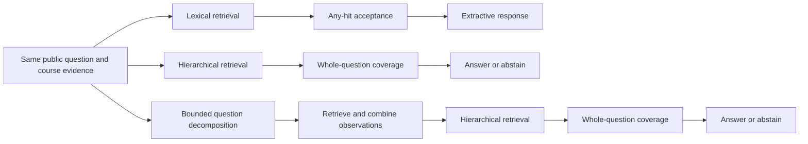
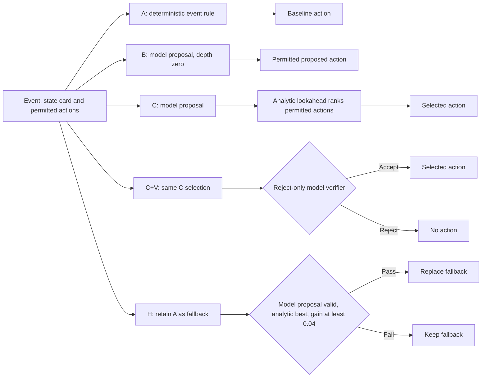

# Tested system designs and why they were not all retained

Prepared: 7 September 2026. Companion to the [24-slide presentation](presentation-structure.md).

この資料は「どの設計を試したか」「どの問題を解こうとしたか」「なぜ期待どおりにならなかったか」を説明するための比較台帳。実験を新規に実施した資料ではない。提出レポートの要約に、既存研究記録の設計過程を明示して補足する。

同一study内で比較する。異なるfoldの成績を一本の改善曲線にしない。以下の図は比較した処理の概略であり、全deployment topologyではない。

## Whole-system manifests and the factual path — slides 7–9

### What changed in the first three designs

下の2経路は、質問の言い回しまで必要概念として扱うcoverageの問題を共有した。plan-observeの追加だけでは、その後段の要求を修正できなかった。manifestが記述する全自律学習機能の失敗を、このfactual比較だけから結論しない。

| 試した構成 | 狙い・加えた仕組み | 実際の所見 | なぜ見送ったか／次の判断 |
| --- | --- | --- | --- |
| Lexical/any-hit control | 単純な検索結果をextractive回答へ渡すbaseline | Round 1 grounded52.66%、answerable action100% | 不完全・誤ったsource regionが残る。最良でもrelease gate未達でbaselineに保持 |
| Evidence-first hierarchical | 階層的な根拠選択とcoverage確認を先に行う | 同じRound 1でgrounded24.81%、answerable action36.46% | whole-question coverageがquestion scaffoldingも必要証拠扱いし過剰abstention |
| Plan-observe/event-sourced manifest | 実行したfactual経路ではbounded decompositionとretrieval observationsの統合を追加 | 同じRound 1でgrounded24.81%、answerable action36.20% | 後段のcoverage問題を共有。event sourcing一般の否定ではなく、このcompositionの失敗 |
| Typed target/cardinality | 質問の対象と必要事実数を明示してclaimを選ぶ | Study Aの同foldで253/397から355/397へ | 有効なdevelopment改善。paraphrase・source region・spanの不一致が残りRefine |
| Typed target + section ranking | 追加のrankingで選択を改善する | 同じ355/397、p95 1.36msから2.79ms | この比較では品質上積みがなく遅延増。追加複雑性を支持しない |
| Source-range candidate set | 残るlineageとregion選択を改善する | Round 3 raw diagnosticではcoverage増でもgrounded91.64%から89.82% | repeated regionの誤選択。さらに実験規約違反で正式なselectionには無効 |
| Source-range + strict ambiguity | 曖昧なtargetをclarifyして誤選択を防ぐ | 同じ診断でgrounded79.90%、answerable failures77 | 答えられるsingle-token targetまで曖昧と判定。selection無効の訂正も必須 |
| BM25 + dominance gate + deterministic facts | 弱い候補すべてを競合とせず、主な解釈を比較して回答を組み立てる | Fresh Study Bでevidence98%、grounded63.25%、hybrid同gate62% | 簡単なfallbackとして保持。必要な全claim/citationが揃わず両方acceptance未達 |

Round 1は495 development cases、350 course-scoped chunks、外部LLMなし。全3候補でboundary action100%、severe unsupported releases0。Study Aは別の497-case foldであり、Round 1の52.66%とStudy Aの89.42%を同一入力の改善幅にしない。

Round 3は親計画の最大2構成に対して3構成を実行した。raw診断は保存されているが、preregistered architecture selectionには無効。評価の不備をproductの原因として数えず、raw成績だけで候補を採用しない。

**Sources:** [Round 1 build](../../research/05_evaluation/course-digital-twin-whole-system-architecture-round-1-001-build-results.md), [Round 1 result](../../research/05_evaluation/course-digital-twin-whole-system-architecture-round-1-001-results.md), Study A in the submitted ZIP, [Round 3 raw result](../../research/05_evaluation/course-digital-twin-whole-system-architecture-round-3-001-results.md), [Round 3 correction](../../research/05_evaluation/course-digital-twin-whole-system-architecture-round-3-001-analysis-correction-001-results.md), R4/Study B.

## Autonomous planner designs — slides 10–14

### The added decision stages

全候補の外側にauthority、evidence、delivery、persistenceの共通制約がある。Hでもauthorized evidenceがない場合はno actionであり、fallbackを無条件配信する図ではない。

| 設計 | 仮説と差分 | 分かった弱点 | 結果として変えたこと |
| --- | --- | --- | --- |
| A: deterministic workflow | event別の許可actionをmodel planningなしで選ぶ | 状況への柔軟性は限定的だが、Fold003のhidden utilityでは最良 | 置換時にも保持するbaselineにした |
| B: governed single planner | 許可集合内でmodel proposalを直接採用。lookaheadなし | Fold003のreported acceptable move44.0%でA70.7%を下回る。すべての劣化理由を特定したわけではない | model proposalを無条件にbaselineより優先する根拠がなかった |
| C: hierarchical model-based | deterministic analytic lookaheadを追加 | Fold003のpreferred-actionに基づく指標は74.0%でもutilityでAに劣る。追加段階だけでは採択根拠にならない | validity、preferred label、utilityを分離して判断 |
| C+V: reject-only verifier | Cの選択後にmodel verifierで拒否可能にする | 有効なmoveまで拒否しreported acceptable move40.0%。拒否しても代替actionを供給しない | reject-only追加を保持せず、baselineを失わない後継へ |
| H: guarded policy-value | Aを保持し、独立したanalytic支持とmarginがあるproposalだけ置換 | heuristic自体とdefault proxy、教育効果は未検証 | fresh比較とconfirmationで条件付き採択。全方式・全指標のwinnerとはしない |

Fold003の「acceptable move」は当時preferred-label一致をtransition validityと混同していた。値は書き換えず、auditでその解釈を修正した。5件のplanner失敗は非権限的なreason文字列の長さ制約に起因し、provider completion97.9%は99.5%gateを下回った。これを「安全制約が全体崩壊した」と説明しない。

| Fresh Fold004: 150 contexts | Valid action | Preferred label | Utility |
| --- | ---: | ---: | ---: |
| A | 100% | 70.7% | 0.7860 |
| B | 100% | 47.3% | 0.7564 |
| C | 100% | 76.0% | 0.7807 |
| H | 100% | 73.3% | 0.7880 |

その後の別の1000-context confirmationでA/Hはutility0.7954/0.8002、preferred74%/73%、valid両方100%。異なるfoldの数値をそのまま差し引かない。Luna/Lunaの保持は、さらに別の300-context・4-allocation比較に基づく。

**Sources:** [Comparison build](../../research/05_evaluation/successor-architecture-paired-comparison-001-build-001-results.md), [Fold001 build](../../research/05_evaluation/successor-architecture-development-fold-001-build-results.md), [Fold003](../../research/05_evaluation/successor-architecture-development-fold-003-single-case-001-results.md), [Fold003 audit](../../research/05_evaluation/successor-architecture-fold-003-causal-audit-001-results.md), [Fold004](../../research/05_evaluation/successor-architecture-policy-value-fold-004-001-results.md), R4/Studies C/D. Build-only記録は比較構造の根拠であり性能証拠ではない。

## Learner state and timing — slides 15–16

推定器と配信時期は別の設計軸。単に「BKTを試した」と説明せず、どのtimingと組み合わせたかを示す。

| Estimator + timing | MSE | Mean messages | Waste | Final simulated mastery |
| --- | ---: | ---: | ---: | ---: |
| Count + constant | 0.084 | 14.0 | 50.6% | 0.314 |
| Count + conditional | 0.084 | 7.0 | 38.8% | 0.302 |
| Count + value | 0.084 | 10.2 | 34.1% | 0.317 |
| BKT + constant | 0.035 | 14.0 | 46.4% | 0.317 |
| BKT + conditional | 0.035 | 8.9 | 36.6% | 0.309 |
| BKT + value | 0.037 | 12.3 | 30.1% | 0.328 |
| PFA + constant | 0.052 | 14.0 | 50.8% | 0.313 |
| PFA + conditional | 0.051 | 7.3 | 41.5% | 0.303 |
| PFA + value | 0.051 | 10.5 | 34.7% | 0.313 |
| Count + oracle (bound) | 0.086 | 12.2 | 0.0% | 0.345 |
| Count + never (bound) | 0.083 | 0.0 | — | 0.288 |

各conditionは240 simulated learners、30 virtual days。MSEはhidden-state推定、wasteとmasteryもsimulator定義。実学生の測定ではない。

- Count/conditionalは配信半減と同時にsimulated masteryも低下。不要な配信を減らすだけでは必要なpracticeも失う。
- BKT/valueは有望だが、next-answer Brier差はinconclusive。第三simulator、decayed-count control、committed observationsとの統合が未完了でGo Deeper。
- Default plannerは依然delivery/event proxy。BKTを試したことと製品に組み込んだことを同一視しない。
- Initial simulationはforgettingがlearningを圧倒する不備で無効化。訂正後の結果と混ぜない。

**Source:** R4/Study E and R3 learner-decision detail in the submitted ZIP.

## Instruction and visual evidence — slide 17

| 試した方式 | 狙い | 期待どおりにならなかった点 | 判断 |
| --- | --- | --- | --- |
| Source text + permitted wrapper | 根拠の出所を守りながら配信 | 統合runの16 check-inがsource card全体へのgeneric wrapper | 運用は実行できても個別指導は未成立 |
| Typed instructional units | source-supportedな説明を具体化 | AI rubricのusefulness44/48対16/48でもcritical attribution errorが1件 | 昇格しない |
| Bounded revision（2候補） | 適切draftを壊さず欠陥draftを修復 | 各47/56修復、56/56適切draft保持でもnecessary→sufficient errorが残る | zero-critical-error gate未達 |
| Historical visual retrieval | textで失う図の根拠を取得 | relevant visual retrieval18/30→28/30でもgrounded両方20/30、critical citation failures | retrieval改善だけでは全体改善を支持しない |
| Fresh omni visual candidate | multimodal経路でgrounded回答を改善 | grounded16/30、text/OCR control26/30。source-region lineageとpacket layoutが弱点 | Drop。controlもcitation defectあり |

異なるstudyの分母や評価者を統合しない。上のusefulnessはassistant reviewのrubric targetsであり独立した学生の評価ではない。

**Source:** R4/R5, Studies F/G and separate visual comparisons in the submitted ZIP.

## State correction and retained infrastructure — slides 18–21

| 設計変更・保持した境界 | 何が不十分だったか | 何を変えたか | 判断の範囲 |
| --- | --- | --- | --- |
| Broad learner evidenceによるgoal completion | Topic Aの証拠でTopic Bまで完了 | Exact objectiveとcommitted target-concept evidenceへscopeを限定 | Unsupported12→0でKeep。学習効果の改善とは別 |
| Default planner adapter | 配信1回だけでprobability proxyが0.5→2/3 | 次の候補はcommitted assessment evidenceを使うadapter | 未実施proposal。現時点の改善として数えない |
| Published release + commit authority | 開始時の許可だけでは生成中の失効を扱えない | 保存時にauthorityとrevisionを確認 | Requirementとbounded local tests。topology性能比較ではない |
| Lease + stable delivery identity | Leaseだけではdelivery保存後・job result保存前の停止を解決しない | 同じdelivery keyで保存済みmessageを認識 | Local recovery。外部全効果のexactly-onceではない |

「比較で負けた」「試験が無効」「まだ接続していない」「比較していない」は別の理由である。SQLiteやlocal deploymentについて、実施していない代替構成のbenchmarkを発表の都合で作らない。

**Source:** R3/R5/R6; Study H. 統合runと現構成全体の再qualificationは別の証拠を必要とする。

## Owner-facing interpretation

本編2枚目で依頼への到達点を共有し、13枚目でmodel proposal固有の追加価値が未確定である点を扱う。23〜24枚目でfactual/assessment品質、learner evidence接続、instruction、全構成確認の依存関係から次の作業を提案する。この台帳のcomparisonで勝ったことだけを、プロジェクト全体の完了条件にしない。
