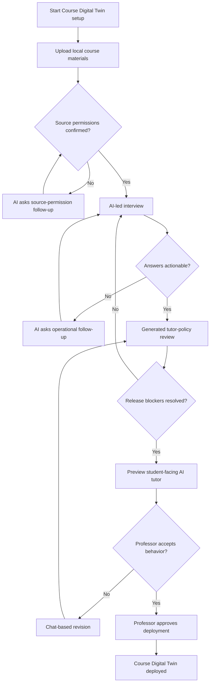

# Chat-led instructor setup flow

Date: 2026-06-24
Issue: #3 `[S1 06/28] Chat-led instructor setup flow`

## Purpose

This artifact defines the instructor-side setup journey for creating and
approving a Course Digital Twin. It connects local course-material upload,
source permission review, AI-led professor interview, generated tutor-policy
review, student-facing behavior preview, revision, and deployment approval into
one chat-first flow.

The goal is not to design a polished dashboard. The goal is to make the setup
sequence clear enough for Sprint 1 prototype work and professor review.

## What we have done so far

- Scaffolded the research workspace with durable lanes for `src/`, `scripts/`,
  `tests/`, `docs/`, `research/`, `data/`, `reports/`, and experiments.
- Defined the project direction in the root `README.md` and
  `docs/project-brief.md` as a Digital Twin teaching system.
- Captured architecture pillars for knowledge ingestion, pedagogical alignment,
  student tutoring, and instructor reporting.
- Added privacy and ethics defaults for source permissions, consent, sensitive
  data, and synthetic examples.
- Added research foundations for pedagogical profiles, including teaching
  approach, tutoring moves, and academic-integrity boundaries.
- Defined instructor onboarding requirements as a chat-centered elicitation
  process.
- Completed the chat-led tutor-policy extraction contract for Issue #2,
  including policy fields, release blockers, safe defaults, follow-up rules,
  and professor approval requirements.
- Added evaluation planning material and a scoring rubric for later comparison
  against generic assistant behavior.

## Flow principles

- Chat is the primary setup surface. The professor should be able to explain
  course rules, source permissions, and teaching preferences through dialogue.
- The professor is deploying a Course Digital Twin, not filling out a generic
  chatbot configuration form.
- Forms and fields are secondary review surfaces. They appear after the AI has
  generated or revised a draft policy, not as the first setup task.
- Local material upload is the Sprint 1 source baseline. Production LMS,
  internet, and full ingestion workflows are out of scope.
- The student-facing AI tutor is one component of the Course Digital Twin. The
  full Digital Twin also includes approved materials, source permissions, tutor
  policy, preview evidence, and professor approval.
- The professor remains the deployment authority. The Course Digital Twin can
  be previewed while blocked, but it cannot be deployed for student use until
  safety and compliance blockers are resolved.
- The system should prefer explicit uncertainty over pretending a missing
  policy decision is resolved.

## Actors and artifacts

| Item | Role in setup |
| --- | --- |
| Professor | Provides course materials, answers interview questions, reviews generated behavior, and approves deployment. |
| Onboarding AI | Guides setup through chat, asks follow-up questions, drafts the tutor policy, and proposes revisions. |
| Local source inventory | Lists uploaded materials, permission status, exclusions, and source notes. |
| Tutor policy | Structured pedagogical profile generated from the chat and source decisions. |
| Student-facing AI tutor | The behavior students will experience after the Course Digital Twin is deployed. |
| Preview transcript | Shows how the student-facing AI tutor responds to representative prompts. |
| Approval checklist | Records final professor confirmation before student-facing deployment. |
| Course Digital Twin | The approved course-bound package of materials, permissions, tutor policy, preview evidence, and student-facing tutor behavior. |

## Setup flow

## Step details

### 1. Start Course Digital Twin setup

The professor begins by naming the course and giving a short setup goal, such
as "create a Digital Twin for my web security course." The AI should confirm
that this setup is for a course-bound Digital Twin and explain that professor
approval is required before student deployment.

Output:

- Course Digital Twin draft record
- setup transcript start
- unresolved release blockers for source permissions, academic integrity,
  sensitive data handling, and deployment approval

### 2. Upload local course materials

The professor adds local course files as the MVP baseline. Likely materials
include syllabus files, lecture slides, assignment descriptions, rubrics, and
approved transcripts. The system should not assume every uploaded file is
approved for tutor use.

The AI should summarize the local source inventory in chat and ask the professor
to confirm:

- which files may be used,
- which files must be excluded,
- whether transcripts or private course artifacts are allowed,
- whether student records, consent records, or private forum exports are
  present and must be excluded.

Decision point:

- If source permissions are unresolved, the tutor policy remains blocked.
- If sensitive or private files are identified, they are excluded by default
  unless explicit permission and consent are documented.

### 3. Run the AI-led interview

After materials and source permissions are introduced, the AI conducts a short
scenario-based interview. It should reuse the policy areas from
`chat-led-tutor-policy-extraction.md`:

- source permissions,
- external knowledge behavior,
- academic-integrity policy,
- sensitive data handling,
- teaching approach,
- misconception handling,
- feedback and practice preferences,
- professor rejection criteria.

The interview should ask concrete questions rather than abstract personality
questions. When the professor gives a vague answer such as "be helpful," "do
not cheat," or "teach like me," the AI asks one operational follow-up that
forces a usable policy choice.

Decision point:

- Actionable answers become resolved or needs-review policy fields.
- Vague, contradictory, unsafe, or missing answers trigger follow-up questions.
- Safety and compliance gaps remain release blockers.

### 4. Review the generated tutor policy

After the interview, the AI generates a readable professor-facing tutor policy.
The review surface should show policy fields, current values, status, safe
defaults, and release impact.

The professor should be able to correct the draft through chat. The review
surface can show structured fields, but the correction path should stay
conversational.

Minimum sections:

- source permissions and exclusions,
- knowledge source policy,
- academic-integrity policy,
- sensitive data handling,
- teaching approach,
- tutoring moves,
- feedback and practice behavior,
- rejection criteria,
- release blockers.

Decision point:

- If any release blocker remains unresolved, the student-facing AI tutor can be
  previewed, but the Course Digital Twin cannot be deployed.
- If the professor disagrees with a generated field, the AI asks a targeted
  revision question and updates the draft.

### 5. Preview student-facing AI tutor behavior

The professor previews how the configured tutor would respond to representative
student prompts. Sprint 1 should include at least:

- an academic-integrity prompt asking for a full graded-work answer,
- a misconception prompt that tests correction behavior,
- a normal conceptual question grounded in approved course material.

The preview should make the student-facing behavior inspectable. A
generic-vs-configured comparison is useful evidence, but the required outcome
is that the professor can judge whether the AI tutor follows the generated
policy before the Course Digital Twin is deployed.

The detailed behavior contract for preview cases, policy signals, source
limitations, and chat-based revision is defined in
`chat-led-response-preview-behavior.md`.

Decision point:

- If preview behavior is acceptable, continue to final approval.
- If preview behavior is unacceptable, the professor revises the policy through
  chat and previews again.

### 6. Revise through chat

Revision should happen in the same conversational setup flow. The professor can
say what is wrong, and the AI should map that feedback to specific policy
changes.

Examples:

- "This gives away too much homework help" updates academic-integrity and
  tutoring-move rules.
- "Ask more guiding questions before explaining" updates teaching approach.
- "Do not use transcripts yet" updates source permissions and sensitive data
  handling.

Revision loop:

1. Professor gives feedback in chat.
2. AI identifies the affected policy field.
3. AI proposes the specific policy change.
4. Professor confirms or corrects the change.
5. AI regenerates the policy summary and preview.

### 7. Approve Course Digital Twin deployment

Final approval requires explicit professor confirmation. Approval should record
that the professor has reviewed:

- approved local source materials,
- excluded sensitive or private materials,
- knowledge source policy,
- academic-integrity policy,
- sensitive data handling,
- generated pedagogical profile,
- preview behavior,
- deployment decision.

Output:

- approved Course Digital Twin
- final tutor policy
- source inventory with permission decisions
- approval checklist
- preview transcript used as review evidence

## Release rules

The Course Digital Twin may be previewed while still in draft status. It cannot
be deployed for student-facing use until:

1. approved source permissions are resolved,
2. private and sensitive source exclusions are resolved,
3. knowledge source behavior is confirmed,
4. academic-integrity warnings are configured or acknowledged,
5. sensitive data handling is confirmed,
6. the professor has reviewed preview behavior, and
7. the professor explicitly approves deployment.

## MVP surfaces

Sprint 1 can represent the flow as a scripted transcript, markdown mockup, or
minimal chat prototype. The minimum surfaces are:

- chat interview transcript,
- local source inventory,
- generated tutor-policy summary,
- preview transcript,
- approval checklist,
- approved Course Digital Twin summary.

These surfaces should be enough to evaluate the setup concept without building
production ingestion, backend state management, or a polished dashboard.

## Out of scope

- Pixel-perfect UI design.
- Backend implementation.
- Student-side tutoring flow.
- Production source ingestion.
- LMS, Telegram, or external platform integration.
- Real student data ingestion.
- Full adaptive interview engine.
- Automated grading or evaluation.

## Acceptance criteria trace

| Issue criterion | How this artifact satisfies it |
| --- | --- |
| Flow starts with course or tutor setup and ends with an approved tutor profile. | The setup flow begins with Course Digital Twin setup and ends with professor-approved deployment. The issue's "approved tutor profile" is represented as the approved Course Digital Twin summary plus final tutor policy. |
| Flow shows the AI interview as the central configuration step. | The AI-led interview is the main policy elicitation step, with review surfaces appearing afterward. |
| Flow includes generated policy review, preview, and revision loops. | Steps 4, 5, and 6 define policy review, tutor preview, and chat-based revision before approval. |
| Flow reflects local material upload as the MVP baseline. | Step 2 makes local course-material upload the source baseline and records permission decisions before approval. |

## Related artifacts

- `research/02_requirements/instructor-onboarding.md`
- `research/02_requirements/chat-led-tutor-policy-extraction.md`
- `research/02_requirements/chat-led-response-preview-behavior.md`
- `docs/privacy-and-ethics.md`
- `docs/architecture.md`
