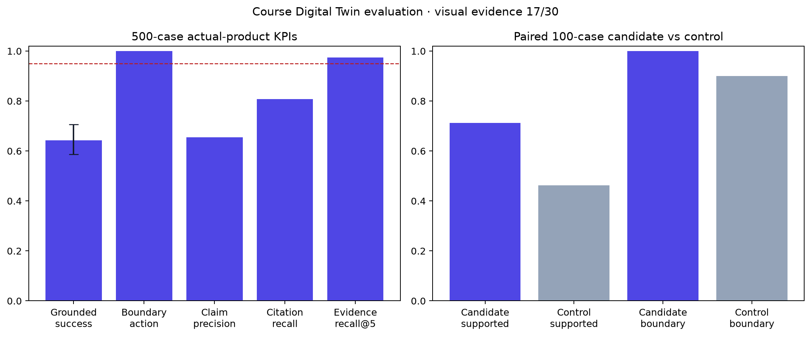

# Course Digital Twin evaluation program 007 result

## Outcome

Program 007 completed as `Refine`. The retrieval stage passed and the corrected
500-case candidate was substantially safer than the 100-case any-hit control,
but it did not meet the preregistered factual, claim, citation, or source-version
gates. The sealed 10,000+1,000 stage therefore remained unopened.

This is a valid development result, not another operational stop. It also
identified a separate reference-quality problem: direct Codex inspection of all
16 cases flagged by the advisory audit found a benchmark defect in every one.
The defects include non-unique questions, malformed or truncated code/LaTeX/table
answers, and questions that do not semantically request their canonical span.
The two cases escalated for researcher review were resolved directly as
non-unique reference questions; no user adjudication is required.

## Actual-product development result

| Metric | Candidate (500) | Gate | Result |
| --- | ---: | ---: | --- |
| Fully grounded factual success | 64.25% | ≥95% | Fail |
| Source-family lower 95% bound | 58.67% | ≥93% | Fail |
| Overall action accuracy | 99.20% | ≥95% | Pass |
| Answerable action accuracy | 99.00% | ≥95% | Pass |
| Boundary action accuracy | 100.00% | ≥98% | Pass |
| Atomic-claim precision / recall | 65.50% / 65.50% | ≥98% / ≥95% | Fail |
| Citation precision / recall | 80.75% / 80.75% | ≥98% / ≥95% | Fail |
| Source-version validity | 97.50% | 100% | Fail |
| Complete evidence@3 | 95.00% | ≥90% | Pass |
| Evidence Recall@5 | 97.50% | ≥95% | Pass |
| Provider completion | 100.00% | ≥99.5% | Pass |
| Severe unsupported releases | 0 | 0 | Pass |

The candidate used 400 exact GPT-5.4 answer calls; the 100 boundary responses
were code-owned. It persisted all 500 responses, used USD 1.3955825, and had
2.453-second p95 provider latency. On the paired 100 cases, supported-answer
retention improved by 25 percentage points (source-family bootstrap lower 95%
bound +12.5 points), and boundary safety was 100% versus 90% for the control.

These measurements show that the action router and evidence gate materially
improved safety and retention. They do not establish 64.25% as a clean estimate
of product quality because the audited reference layer contains confirmed
defects. Both the product grounding method and the reference package require a
fresh source-disjoint confirmation.

## Direct source-truth audit

The advisory model identified 16 possible source-truth concerns. Direct Codex
inspection compared each question, canonical answer, exact source range, and
the other source regions in its cluster.

- 5 questions were non-unique or underspecified, including both escalated
  cases (`academic-action-router-dev-0079-q4` and
  `academic-action-router-dev-0083-q4`).
- 9 canonical answers were malformed, truncated, or non-responsive code,
  equation, or table fragments.
- 2 additional questions were not natural or semantically well-formed even
  though a related source span existed.

The advisory model marked six of these as source-valid, which demonstrates why
its votes remain advisory. The authoritative finding is the direct
source-linked audit: all 16 flagged references are unsuitable for a clean
confirmatory benchmark in their current form.

## Supplementary results

- True visual: 17/30 clusters reached complete visual evidence@3; atomic
  Evidence Recall@5 was 76.64%; all 30 citations retained original-region
  lineage; boundary releases were zero; seven descriptions contained
  unsupported content. Decision: `Go Deeper`, not selected.
- Synthetic profile C0-C2: 12 cases and 36 complete calls. C2 contained the
  configured profile features in all 12 cases, but no real professor approved
  the profile. This is diagnostic only and is not professor-fidelity evidence.
- Provider-backed T0/T1 and local release regression were correctly skipped
  because factual development did not pass.

The whole program used 614 calls or batches and USD 1.82048188. It processed
only pinned public educational sources and synthetic inputs.

## Decision and finite successor

Preserve program 007 as immutable `Refine` evidence and revoke its authority.
Do not spend on the sealed 10,000+1,000 package while its prerequisite
reference method is known to be defective.

The finite successor reuses the already frozen fresh 160-cluster/800-case
reference-validation reserve. It changes only the demonstrated attempt-002
harness defect: model output is validated as an exact unique case-ID set and
then deterministically reordered, rather than requiring provider array order.
It retains the source-visible author, target-blind reviewer, deterministic
span/action authority, exact 100-cluster/500-case selection, and unchanged
quality gates. A valid pass produces a fresh 500-case package; a valid quality
failure is reported and stops the 10,000 stage.

## Limitations

- Development cases are now known and cannot support a new confirmatory claim.
- The direct audit covers all 16 flagged concerns, not an independent random
  human sample of all 500 references.
- Both authoring and advisory review used OpenAI models from one provider
  family; deterministic source truth and direct inspection remain authoritative.
- Open educational sources do not establish performance on private course
  materials, professor fidelity, student usability, learning outcomes, or
  durable production hosting.

