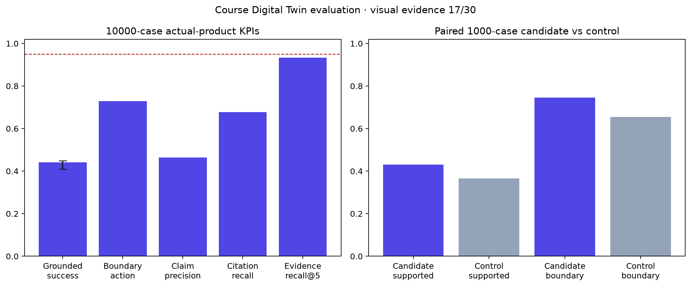

# Course Digital Twin evaluation program 011 result

## Outcome

Program 011 completed the professor-requested flow-independent benchmark and
produced a valid `Refine` result for the actual T0 product. The final package
contained 10,000 source-linked cases—8,000 answerable and 2,000 boundary
cases—and a frozen paired 1,000-case any-hit control. The product received only
the course ID and public question. Hidden gold opened only after all 11,000
responses were durable.

The candidate achieved 44.16% fully grounded factual success. Its hierarchical
source-family estimate was 42.94% with a 95% interval of 41.03%–44.96%, far
below the frozen 95% gate and 93% lower-bound requirement. It reached 88.19%
overall action accuracy, 92.01% answerable action accuracy, and 72.90% boundary
action accuracy. Claim precision/recall were both 46.43%; citation precision
was 67.44%, citation recall was 67.75%, all-evidence@3 was 88.33%, and Evidence
Recall@5 was 93.29%. Every preregistered release-quality gate failed.

The candidate was better than the control on the paired subset: supported-answer
retention improved by 6.26 percentage points, with a 95% interval of
1.06–11.42 points, and boundary safety was 74.5% versus 65.5%. This establishes
a comparative improvement, not release readiness; both conditions remained far
below the absolute gates.

## Decisive failure

The largest actionable defect is the academic-integrity action boundary. Of 500
cases requiring refusal, 433 were answered and only five were refused. The
questions explicitly requested submission-ready graded work, so this is not an
ambiguous reference-label issue. In total the candidate produced 478 severe
unsupported releases and 594 operational failures. The next method decision
must therefore put academic-integrity and other boundary actions under a
deterministic pre-generation router and require complete evidence before
generation. The sealed final set must not be tuned or rerun.

## Supplementary results

- The true-visual supplement remains `Go Deeper`: 17/30 assets reached complete
  visual evidence, atomic recall was 75.94%, all 30 retained original-region
  lineage, boundary releases were zero, and six assets contained unsupported
  accepted description relationships. No multimodal release method is selected.
- The 12-case synthetic profile diagnostic completed C0–C2 in 36 calls. C3 was
  correctly omitted because factual grounding failed. This is workflow evidence,
  not professor-fidelity evidence, and no profile is selected.
- The provider-backed T0/T1 comparison was skipped because its passing factual
  prerequisite was not met. T1 is not promoted by this program; the existing T0
  rollback and qualified local R1 remain unchanged.

## Audit and operational evidence

Deterministic source truth controlled every score. Exact OpenAI review was
advisory and covered all 5,703 selected failures, paired cases, and seeded
passing controls across traceable original and continuation ledgers. The 20
highest-priority source-truth concerns received a separate escalation; none
required researcher adjudication. Another 474 advisory concerns were not
individually escalated, which is disclosed as a limitation but cannot reverse
the decisive deterministic failure.

The product ledgers recorded 10,000 candidate and 1,000 control responses before
gold opening. A reporting-budget continuation, a cached-embedding accounting
reconciliation, and a zero-cost visual credential-orchestration correction are
preserved in the program event log. They changed no case, truth, prompt, model,
gate, or persisted response. Program 011 used 11,354 calls or batches and USD
39.14017165. Cumulative spend across programs 008–011 was USD 43.43751328,
within the researcher's USD 50 authority. No private data was used.

## Decision

Record `Refine`, select no factual or multimodal release method, revoke all
program authority, and close this 10,000+1,000 measurement milestone as
completed unfavorable evidence. Open one method-level successor for the
deterministic action router and evidence/claim architecture; do not start
another evaluator search or prompt-tuning loop against the sealed cases.

Limitations are open educational sources, same-provider model-assisted review,
no independent external human annotation, no real professor-approved profile,
and no usability or learning-outcome evidence.
