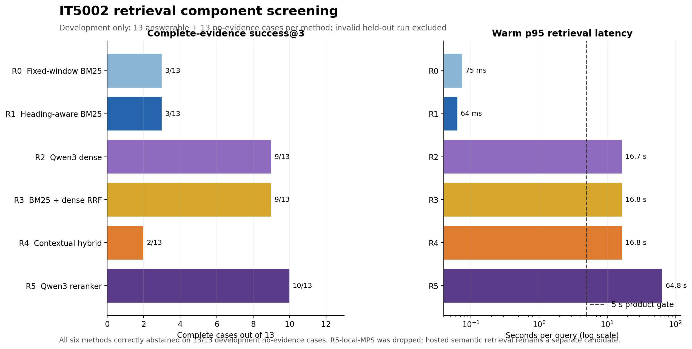

# Professor message: IT5002 retrieval component result

Professor, I compared six retrieval configurations over all 13 IT5002
lectures. On the development set, Qwen3 reranking retrieved complete evidence
for `10/13` answerable cases versus `3/13` for heading-aware BM25; every method
correctly abstained on `13/13` no-evidence cases.

The local Qwen3 profile was not deployable: warm p95 latency was `64.8 s`
against the `5 s` gate, and the separate held-out process ended after `29/59`
cases, so I am not claiming held-out superiority. I retained BM25 as the local
fallback and will next evaluate hosted semantic retrieval as a separate
quality-latency-cost candidate.

Would you consider this quality-versus-deployability trade-off a meaningful
component contribution for the project report?

Optional detail:
[`it5002-retrieval-rapid-v1-results.md`](../../05_evaluation/it5002-retrieval-rapid-v1-results.md).
